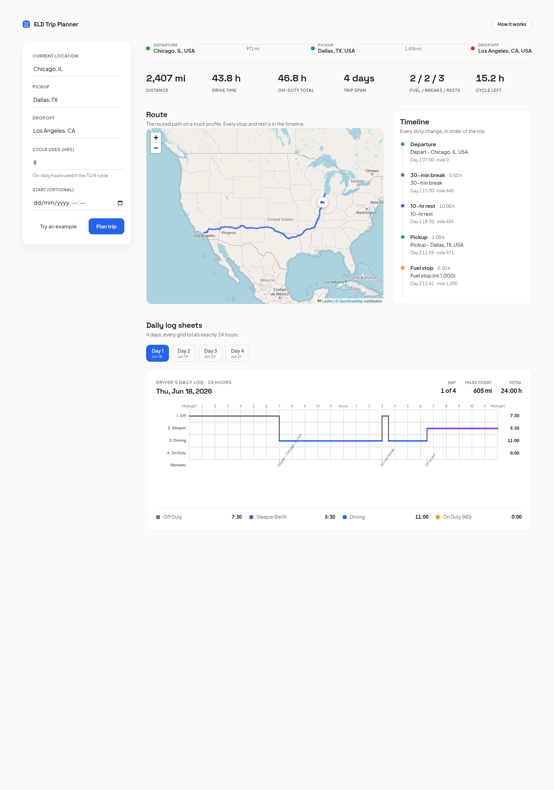
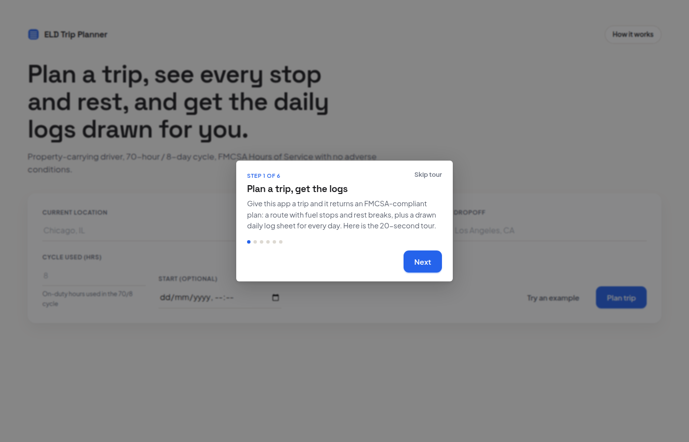
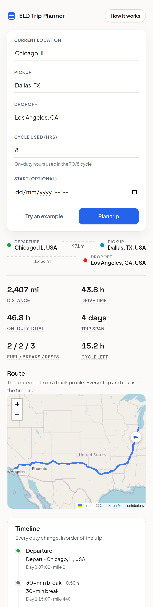

# ELD Trip Planner

Plan a property-carrying truck trip and get an FMCSA-compliant Hours-of-Service plan:
a routed map, a timeline of every stop and rest, and a drawn ELD daily-log sheet for
each day of the trip. You give it four inputs; it does the rest.



## What it does

Enter a **current location**, **pickup**, **dropoff**, and the **hours already used in
your current 70-hour / 8-day cycle**. The app then:

- **Geocodes** the three places and **routes** them on a truck profile
  (OpenRouteService `driving-hgv`).
- **Simulates Hours of Service** minute by minute: the 11-hour driving limit, the
  14-hour window, a 30-minute break after 8 hours of driving, the 70-hour/8-day cycle,
  10-hour resets, and 34-hour restarts. Fuel stops are added every 1,000 miles, with
  1 hour on duty for pickup and 1 hour for dropoff.
- **Draws the logs**: one FMCSA 24-hour grid per day (Off Duty / Sleeper / Driving /
  On Duty), with the duty line, per-status totals that sum to exactly 24 hours, and a
  remarks row. Longer trips produce multiple sheets.

The hosted version is tested for accuracy, so the Hours-of-Service engine is the heart
of the project: it is pure, deterministic Python with **99% test coverage** and an
**independent compliance validator** that re-checks every generated schedule.

|  Guided tour  |  Mobile  |
| :-----------: | :------: |
|  |  |

## Highlights

- **Accurate**: 91 backend tests, a 30-case HOS matrix, and a standalone validator that
  re-walks each result and re-checks all four limits.
- **Real routing**: OpenRouteService truck profile + Leaflet / OpenStreetMap map with an
  animated truck driving the route.
- **Drawn ELD logs**: crisp SVG grids; the duty line animates onto the grid; day tabs.
- **Considered UX**: the form starts as a hero, then glides into a sticky sidebar while
  the results build; count-up metrics, a dynamic loading sequence, tooltips, a skippable
  guided tour, and a fully responsive layout.
- **Offline preview**: append `?demo=1` to load a bundled sample plan with no backend.

## Tech stack

| Layer | Choices |
|---|---|
| Backend | Django 5 + Django REST Framework, pure-Python HOS engine, `requests` |
| Routing / maps | OpenRouteService (geocoding + directions), Leaflet + OpenStreetMap |
| Frontend | React 18 + Vite, react-leaflet, SVG log drawing, Vitest |
| Quality | pytest + coverage, ruff, black, ESLint, Prettier, GitHub Actions CI |

The HOS engine (`backend/trips/hos/`) imports neither Django nor the network, so it is
unit-tested in isolation.

## How the accuracy is guaranteed

- **`hos/simulator.py`** drives the trip in integer minutes. Before each driving chunk it
  ensures the driver may legally drive (inserting a 34-hour restart, 10-hour reset, or
  30-minute break in priority order), then drives the largest chunk bounded by every
  limit, the leg end, and the next fuel mark.
- **`hos/segments.py: validate_compliance`** independently re-walks the emitted timeline
  and re-checks the 11/14/8/70-hour limits plus conservation. It runs on every test
  scenario, so the generator never grades its own homework.
- Integer-minute arithmetic makes the "every day totals 24 hours" invariant exact.

## Project structure

```
eld-trip-planner/
  backend/
    config/            Django project (settings, urls, wsgi)
    trips/
      hos/             pure HOS engine: constants, state, simulator,
                       day_splitter, segments (+ validator), geo, formatters
      services/        OpenRouteService geocoding + routing (provider abstraction)
      planner.py       orchestrator: geocode -> route -> simulate -> split -> format
      views.py         thin DRF views
      tests/           91 tests (engine matrix, API, services, geo)
  frontend/
    src/
      components/      TripForm, RouteMap, StopsList, LogSheets, LogGrid, Tour, ...
      hooks/           useTripPlan, useCountUp
      utils/, api/, constants.js
  .github/workflows/   CI (lint + tests + build)
```

## Run it locally

You need Python 3.11+ and Node 18+, plus a free
[OpenRouteService API key](https://openrouteservice.org/dev/#/signup).

### Backend (port 8000)

```bash
cd backend
python3 -m venv venv && source venv/bin/activate
pip install -r requirements-dev.txt
cp .env.example .env          # then set ORS_API_KEY and DJANGO_SECRET_KEY
python manage.py runserver
```

### Frontend (port 5173)

```bash
cd frontend
npm install
cp .env.example .env          # VITE_API_BASE_URL=http://localhost:8000
npm run dev
```

Open http://localhost:5173 and click **Try an example**, or visit
`http://localhost:5173/?demo=1` for the offline sample.

## Tests and quality

```bash
# backend
cd backend && pytest --cov=trips        # 91 tests, ~97% coverage
ruff check trips/ config/ && black --check trips/ config/

# frontend
cd frontend && npm test                 # Vitest
npm run lint && npm run build
```

CI runs all of the above on every push (`.github/workflows/ci.yml`).

## API

- `GET /api/health/` -> `{"status": "ok"}`
- `POST /api/plan-trip/`
  - Body: `{ current_location, pickup_location, dropoff_location, current_cycle_used, start_datetime? }`
  - Returns `{ inputs, geocoded, route, summary, stops, days }`, where `days[]` carries
    the per-status totals, the duty segments, and the remarks for each log sheet.
  - Errors: `400` for bad input or an un-geocodable location, `502` if the routing
    provider fails. The endpoint is throttled (`AnonRateThrottle`).

## Documented assumptions

| Assumption | Default |
|---|---|
| Pickup / dropoff duty time | 1 hour each (on duty, not driving) |
| Average truck speed (for HOS time) | 55 mph (configurable) |
| Fuel stop | every 1,000 miles, 0.5 hour on duty |
| 10-hour daily reset | Sleeper Berth |
| Cycle model | 70 - current_cycle_used, replenished only by a 34-hour restart |
| Sleeper-berth split (7+3 / 8+2) | out of scope; the planner uses full 10-hour resets |

## Deployment

- **Frontend** -> Vercel. Set the project root to `frontend/` and add
  `VITE_API_BASE_URL` pointing at the backend.
- **Backend** -> any host that runs Django. In production it sits behind gunicorn + nginx
  with HTTPS (the frontend is HTTPS, so the API must be too, or the browser blocks it).
  `DEBUG` defaults to `False` and a `DJANGO_SECRET_KEY` is required when `DEBUG=False`.

Set on the backend host: `DJANGO_SECRET_KEY`, `DJANGO_ALLOWED_HOSTS`,
`CORS_ALLOWED_ORIGINS` (the Vercel URL), and `ORS_API_KEY`.

## Pushing to GitHub

```bash
git init && git add . && git commit -m "ELD trip planner"
git branch -M main
git remote add origin https://github.com/YOUR_USER/eld-trip-planner.git
git push -u origin main
```

`.env` files are git-ignored; never commit your API key.
